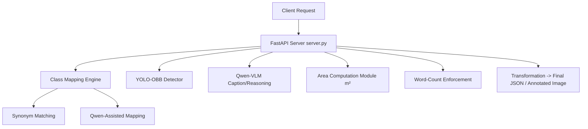

# 🚀  Vision42 GeoNLI — Backend

### **FastAPI + YOLO-OBB + Qwen-VLM Powered Multimodal Understanding**
**File:** `server.py`

## 📌 Overview

`server.py` implements the entire backend pipeline for **GeoNLI** — a multimodal reasoning system capable of understanding satellite imagery. The system is engineered for accuracy, determinism, and robustness, featuring class mapping logic, synonym resolution, and explicit post-processing for satellite intelligence tasks.

**Key Capabilities:**

  * **YOLO Oriented Bounding Box (OBB)** detection.
  * **Qwen Vision-Language** reasoning for natural language queries.
  * **Caption generation** with strict word-count control (40–60 words).
  * **Grounding queries** (object localization & rotated bounding boxes).
  * **Numeric reasoning**, including object counting and real-world area computation using spatial resolution metadata.
  * **Binary and semantic queries**.

**API Modes:**

1.  **Interactive Mode** (`/geoNLI/eval`) for frontend live queries.
2.  **Evaluation Mode** (`/api/v1/evaluate`) for structured dataset testing.

-----

## ⚙️ Core System Architecture

The system integrates both symbolic matching and ML-driven inference, making it resilient to natural language variability and robust in real-world satellite use cases.



-----

## 🧠 YOLO-OBB Class Mapping Engine

Satellite queries often refer to objects indirectly (e.g., "aircrafts", "air field", "stor tanks"). `server.py` implements a two-stage class resolver:

### 1\. Synonym & Partial-Match Dictionary (`YOLO_SYNONYMS`)

Maps natural phrases to YOLO class keys using over **200+ synonym patterns** across 27 satellite classes.

  * **Example:** "aircrafts", "jets", "plane" $\rightarrow$ `airplane`
  * **Example:** "stor tanks", "fuel tank" $\rightarrow$ `storagetank`

### 2\. Qwen-VLM Fallback

If synonyms fail, Qwen is utilized to resolve ambiguity:

> "Identify the object class referred to in the query…"

The system normalizes and validates Qwen’s output before using it to ensure determinism.

-----

## 🎯 YOLO-OBB Detection Pipeline

The server loads a custom YOLO-OBB model trained specifically on satellite imagery. This enables detection of stadiums, airplanes, swimming pools, ships, and more with rotation awareness.

```python
yolo_model = YOLO("/data1/MP3/best.pt")
```

**Processing Steps per Image:**

1.  Extract rotated bounding boxes via `result.obb`.
2.  Normalize coordinates (`cx`, `cy`, `w`, `h`, `angle`).
3.  Convert to **8-point polygon format** for evaluation mode.
4.  Filter by detected class (if query-specific).

-----

## 📐 Area Computation in Real-World Meters²

The `compute_area_from_obb()` function converts YOLO detections into physical areas using spatial resolution metadata.

**Logic:**

```python
width_m = width_pixels * spatial_resolution_m
height_m = height_pixels * spatial_resolution_m
area_m2 = width_m * height_m
```

This enables numeric queries such as:

> *"What is the area of the blue region in the larger swimming pool in m²?"*

-----

## 📝 Caption Generation — With Strict Word Control

Satellite captions must be informative yet concise. `server.py` enforces a **40–60 word limit** using:

  * A specialized Qwen prompt.
  * Post-generation word count enforcement.
  * Automatic truncation if the caption exceeds the upper limit.

-----

## 🔍 Query Types Supported

| Type | Description |
| :--- | :--- |
| **1. Caption Queries** | Word-controlled descriptive generation using `ask_qwen_caption()`. |
| **2. Grounding Queries** | Locates objects, returns OBB polygons, or provides annotated images in interactive mode. |
| **3. Numeric Queries** | Object counting, area computation, and largest/smallest/total area analysis. |
| **4. Binary Queries** | Yes/No questions (e.g., *"Is there any airplane in the scene?"*). |
| **5. Semantic Queries** | Attribute-based questions (e.g., *"What is the color of the building?"*). |

-----

## 📡 API Endpoints

### 1️⃣ Interactive Mode — `/geoNLI/eval`

  * **Input:** `file` (Image), `query` (Natural Language).
  * **Behavior:** Auto-detects query type.
  * **Output:** JSON (caption, numeric, binary, semantic) or Annotated JPEG (grounding queries).

### 2️⃣ Evaluation Mode — `/api/v1/evaluate`

  * **Input:** Structured JSON.
    ```json
    {
      "input_image": {
        "image_id": "sample1.png",
        "image_url": "...",
        "metadata": { "width": 512, "height": 512, "spatial_resolution_m": 1.57 }
      },
      "queries": { ... }
    }
    ```
  * **Output:** Full structured response containing Caption, Grounding OBB list, and answers.

### 3️⃣ Utility Endpoints

  * `/test-class-mapping`: Verifies query-to-class mapping behavior.
  * `/health`: Reports system and YOLO load status.

-----

## 🧪 Error Handling & Logging

  * **Visualization:** `draw_obb_on_image()` produces clean rotated boxes without labels for internal verification.
  * **Logging:** Detailed console logs for every pipeline step.
  * **Resilience:** Graceful fallback for missing detections and Qwen mapping ambiguities.

-----

## 🚀 Running the Server

**Prerequisites:**

  * YOLO model located at `/data1/MP3/best.pt`.
  * Qwen server running at `localhost:8000`.

**Command:**

```bash
uvicorn server:app --host 0.0.0.0 --port 15200
```

-----

## 🏁 Summary

`server.py` is the core intelligence layer of the GeoNLI system. It is a fully integrated multimodal satellite reasoning engine featuring **OBB object detection**, **Vision-language reasoning**, **Real-world numeric computation**, and **Controlled caption generation**. It serves these features via robust FastAPI endpoints designed for both live interaction and batch evaluation.