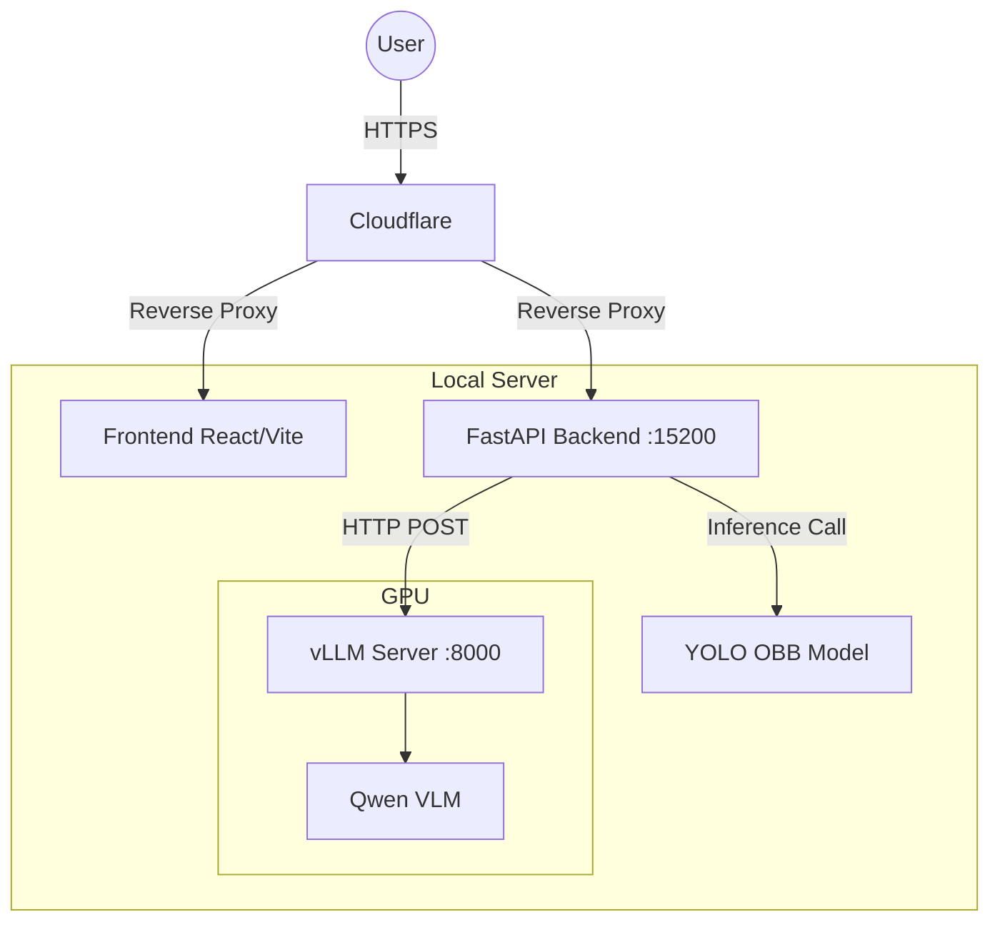

# GeoNLI System - Environment Specifications

## Operating System

- **Linux** (validated on Ubuntu 22.04 LTS, 64-bit)
- Requires NVIDIA GPU drivers with CUDA 11.8+ support

---

## Core Runtimes and Languages

- **Python 3.10** (managed via Conda virtual environment)
- **Node.js 18+** with npm 9+ (for React/Vite frontend)
- **Bash shell** (for deployment and orchestration scripts)

---

## Python Libraries and Frameworks

### Backend and API Layer

| Library | Version | Purpose |
|---------|---------|---------|
| `fastapi` | Latest | Web framework for REST API endpoints |
| `uvicorn[standard]` | Latest | ASGI server for FastAPI application |
| `pydantic` | Latest | Request/response validation and data modeling |
| `python-multipart` | Latest | Multipart/form-data handling for file uploads |
| `requests` | Latest | HTTP client for calling vLLM/Qwen API |
| `numpy` | Latest | Numerical operations and array handling |
| `opencv-python` | Latest | Image decoding, preprocessing, and annotation |
| `Pillow` | Latest | Additional image utilities |
| `typing-extensions` | Latest | Extended type hint support |

### Object Detection (YOLO OBB)

| Library | Version | Purpose |
|---------|---------|---------|
| `ultralytics` | Latest | YOLO11 OBB model loading and inference |
| `torch` | 2.0+ (CUDA 11.8) | PyTorch deep learning framework |
| `torchvision` | Compatible | Vision utilities for PyTorch |
| `torchaudio` | Compatible | Audio utilities (dependency) |

**Model Asset:**
- Custom-trained YOLO OBB checkpoint: `best.pt`
- Classes: 27 remote sensing object categories
- Format: Ultralytics YOLO11 OBB with oriented bounding box support

### Vision-Language Model (VLM) and Serving

| Library | Version | Purpose |
|---------|---------|---------|
| `vllm` | Latest | OpenAI-compatible high-throughput model server |
| `transformers` | Latest | Hugging Face model configs and tokenizer |
| `accelerate` | Latest | Hardware-aware model execution |
| `huggingface-hub` | Latest | Model weight downloading and management |

**Model Asset:**
- Model: `Qwen/Qwen2.5-VL-7B-Instruct` (or compatible Qwen vision-language model)
- Location: `./qwen/` directory
- Contents: `config.json`, `model-*.safetensors`, tokenizer files
- API: Exposed via vLLM at `http://localhost:8000/v1/chat/completions`

---

## JavaScript / Frontend Libraries

| Library | Version | Purpose |
|---------|---------|---------|
| React | 18+ | Component-based UI framework |
| Vite | Latest | Development server and build tool |
| `axios` | Latest | HTTP client for backend communication |
| `react-dropzone` | Latest | File upload and drag-and-drop interface |
| `react-markdown` | Optional | Markdown rendering in UI |

**Configuration:**
- Environment variable `VITE_API_URL` points to FastAPI backend
- Deployment: Vercel (production) or local dev server (development)

---

## Hardware Requirements

### GPU (Required for VLM)

- **NVIDIA GPU** with ≥ 24 GB VRAM (recommended: RTX 3090, A100, or equivalent)
- **CUDA 11.8+** with compatible drivers installed
- **Purpose:** Running Qwen VLM via vLLM in BF16 precision

### CPU and Memory

- **CPU:** 8+ cores recommended
- **RAM:** 32 GB minimum, 64 GB recommended
- **Storage:** 50+ GB for model weights and application data

---

## External APIs and Protocols

### 1. OpenAI-Compatible Chat Completions API (vLLM Local)

**Endpoint:** `http://localhost:8000/v1/chat/completions`

**Request Schema:**
```json
{
  "model": "/data1/MP3/qwen",
  "messages": [
    {
      "role": "user",
      "content": [
        {"type": "text", "text": "Describe this image"},
        {"type": "image_url", "image_url": {"url": "data:image/jpeg;base64,..."}}
      ]
    }
  ],
  "max_tokens": 512,
  "temperature": 0.1
}
````

**Response Schema:**

```json
{
  "choices": [
    {
      "message": {
        "content": "Response text..."
      }
    }
  ]
}
```

### 2\. RESTful HTTP API (FastAPI Backend)

**Base URL:** `http://localhost:15200` (or Cloudflare-proxied HTTPS in production)

**Endpoints:**

| Endpoint | Method | Purpose |
|----------|--------|---------|
| `/` | GET | API info and YOLO class list |
| `/health` | GET | Service health check |
| `/geoNLI/eval` | POST | Interactive query (multipart) |
| `/api/v1/evaluate` | POST | Batch evaluation (JSON) |
| `/docs` | GET | Swagger UI documentation |
| `/redoc` | GET | ReDoc documentation |

-----

## Self-Developed Routing and Internal Logic

All custom application logic resides in `server.py` and includes:

### 1\. Interactive Endpoint: `/geoNLI/eval`

**Type:** POST (multipart/form-data)

**Inputs:**

  - `file`: Satellite image (JPEG/PNG binary)
  - `query`: Natural language question or instruction
  - `query_type`: Optional explicit type (`caption`, `grounding`, `numeric`, `binary`, `semantic`, or `auto`)

**Internal Processing:**

1.  **Query Classification:**

      - Keyword-based pattern matching
      - LLM-based classification fallback
      - Determines appropriate processing pipeline

2.  **Execution Routing:**

      - **Caption queries** → Qwen VLM with word count enforcement (40-60 words)
      - **Grounding queries** → YOLO OBB detection + optional attribute-based filtering
      - **Numeric queries** → YOLO count or Qwen for non-countable metrics
      - **Binary queries** → Qwen yes/no reasoning
      - **Semantic queries** → Qwen open-ended QA

3.  **Response Generation:**

      - Text queries: JSON response
      - Grounding queries: JPEG image with drawn bounding boxes

**Example Request:**

```bash
curl -X POST http://localhost:15200/geoNLI/eval \
  -F "file=@satellite.jpg" \
  -F "query=Locate the tallest storage tank" \
  -F "query_type=grounding"
```

**Example Response (Grounding):**

  - Content-Type: `image/jpeg`
  - Headers: `X-Detection-Count: 3`, `X-Target-Class: storagetank`
  - Body: Annotated image binary

### 2\. Evaluation Endpoint: `/api/v1/evaluate`

**Type:** POST (application/json)

**Input Schema:**

```json
{
  "input_image": {
    "image_id": "sample1.png",
    "image_url": "[https://example.com/image.jpg](https://example.com/image.jpg)",
    "metadata": {
      "width": 512,
      "height": 512,
      "spatial_resolution_m": 1.57
    }
  },
  "queries": {
    "caption_query": {
      "instruction": "Generate a detailed caption..."
    },
    "grounding_query": {
      "instruction": "Locate all storage tanks"
    },
    "attribute_query": {
      "binary": {"instruction": "Is there a runway?"},
      "numeric": {"instruction": "How many airplanes?"},
      "semantic": {"instruction": "What is the terrain type?"}
    }
  }
}
```

**Internal Processing:**

1.  Downloads image from `image_url`
2.  Executes all query types in parallel:
      - Caption: Qwen with strict 40-60 word enforcement
      - Grounding: YOLO OBB → 8-point normalized format
      - Binary/Numeric/Semantic: Qwen reasoning
3.  Computes physical metrics using `spatial_resolution_m` (area in m²)
4.  Returns structured response mirroring input schema

**Output Schema:**

```json
{
  "input_image": { ... },
  "queries": {
    "caption_query": {
      "instruction": "Generate a detailed caption...",
      "response": "The image shows a coastal industrial area..."
    },
    "grounding_query": {
      "instruction": "Locate all storage tanks",
      "response": [
        {
          "object-id": "1",
          "obbox": [0.2, 0.3, 0.4, 0.3, 0.4, 0.5, 0.2, 0.5]
        }
      ]
    },
    "attribute_query": {
      "binary": {"instruction": "...", "response": "yes"},
      "numeric": {"instruction": "...", "response": "5"},
      "semantic": {"instruction": "...", "response": "urban coastal"}
    }
  }
}
```

### 3\. Attribute-Based Grounding Filter

**Purpose:** Refine YOLO detections based on natural language attributes

**Process:**

1.  YOLO detects all instances of target class (e.g., 12 storage tanks)
2.  Extract spatial descriptors (left/center/right, top/middle/bottom) and sizes
3.  Construct prompt for Qwen:
    ```text
    Query: "Locate the tallest storage tank"

    Detected objects:
    Object 1: located in left-top, size 0.05x0.08
    Object 2: located in center-middle, size 0.12x0.15
    ...

    Which object matches the query? Answer with object ID.
    ```
4.  Qwen selects matching object ID(s)
5.  Filter detection list to only selected instances

**Supported Attributes:**

  - **Positional:** "second from left", "top-right corner", "center"
  - **Size-based:** "tallest", "largest", "smallest"
  - **Visual:** "dome-shaped", "open tank", "closed tank"
  - **Color:** "red", "white", "blue" (when applicable)

### 4\. Class Mapping System

**Purpose:** Map natural language object names to YOLO's 27 fixed classes

**Strategy:**

1.  **Synonym Dictionary** (99+ synonyms):

      - "aircrafts" → `airplane`
      - "tanks" / "storage" → `storagetank`
      - "vessels" → `ship`
      - "rest area" → `Expressway-Service-area`

2.  **Qwen-Assisted Mapping** (fallback):

      - If no synonym match, prompt Qwen with:
        ```text
        Query: "Find all vessels in the image"
        Available classes: [airplane, ship, storagetank, ...]
        Which class does this refer to?
        ```

3.  **Normalization:**

      - Remove spaces, hyphens
      - Convert to lowercase
      - Match singular/plural variants

**Example Mappings:**

  - "storage tanks" → `storagetank`
  - "air planes" → `airplane`
  - "swimming pool" → `dam` (due to training data overlap)
  - "boats" → `ship`

-----

## Service Architecture



**Communication:**

  - Frontend ↔ Backend: REST API over HTTP/HTTPS
  - Backend ↔ Qwen: HTTP POST to OpenAI-compatible endpoint
  - Backend ↔ YOLO: In-process Python function calls

-----

## Deployment Configuration

### Development

```bash
# Backend
uvicorn server:app --host 0.0.0.0 --port 15200 --reload

# Qwen vLLM
python -m vllm.entrypoints.openai.api_server \
  --model /data1/MP3/qwen \
  --port 8000 \
  --max-model-len 8192 \
  --dtype bfloat16

# Frontend
cd frontend && npm run dev -- --port 5173
```

### Production

```bash
# Backend (with Gunicorn)
gunicorn server:app \
  --workers 4 \
  --worker-class uvicorn.workers.UvicornWorker \
  --bind 0.0.0.0:15200 \
  --timeout 300

# Qwen vLLM (with PM2)
pm2 start "python -m vllm.entrypoints.openai.api_server \
  --model /data1/MP3/qwen \
  --port 8000 \
  --max-model-len 8192 \
  --dtype bfloat16" \
  --name qwen-vllm

# Frontend (Vercel)
vercel --prod
```

**Reverse Proxy/CDN:** Cloudflare

  - SSL/TLS termination
  - DDoS protection
  - Rate limiting (10 req/min per IP)
  - Static asset caching

-----

## Security and Rate Limiting

### CORS Configuration

```python
# server.py
app.add_middleware(
    CORSMiddleware,
    allow_origins=["[https://yourdomain.com](https://yourdomain.com)"],  # Restrict in production
    allow_credentials=True,
    allow_methods=["*"],
    allow_headers=["*"],
)
```

### Rate Limiting (Cloudflare)

  - **10 requests per minute per IP** for `/geoNLI/eval`
  - **Unlimited** for `/health` and static assets
  - **Geographic restrictions** optional

### Input Validation

  - File size limit: 10 MB
  - Allowed formats: JPEG, PNG
  - Image dimensions: Auto-resized to max 512px before VLM processing
  - Query length: Max 500 characters

-----

## Monitoring and Logging

### Log Files

```text
/data1/MP3/.logs/
├── qwen.log      # vLLM server logs
├── backend.log   # FastAPI application logs
└── frontend.log  # Vite dev server logs (dev only)
```

### Health Checks

```bash
# Backend health
curl http://localhost:15200/health
# Response: {"status": "healthy", "yolo": "loaded", "yolo_classes": 27}

# Qwen health
curl http://localhost:8000/v1/models
# Response: {"data": [{"id": "/data1/MP3/qwen", ...}]}
```

### Performance Metrics

| Metric | Development | Production |
|--------|-------------|------------|
| YOLO inference | 50-150ms | 50-150ms |
| Qwen inference | 2-5 seconds | 1-3 seconds |
| Image preprocessing | 50-100ms | 50-100ms |
| **Total request time** | **3-8 seconds** | **2-5 seconds** |

-----

## Dependency Installation

### Backend Dependencies

```bash
# PyTorch with CUDA 11.8
pip install torch torchvision torchaudio --index-url [https://download.pytorch.org/whl/cu118](https://download.pytorch.org/whl/cu118)

# Core dependencies
pip install fastapi uvicorn[standard] python-multipart pydantic requests

# Computer vision
pip install ultralytics opencv-python numpy pillow

# VLM serving
pip install vllm transformers accelerate huggingface-hub
```

### Frontend Dependencies

```bash
cd frontend
npm install react react-dom vite axios react-dropzone
```

-----

## Summary

This system integrates three core components:

1.  **YOLO OBB detector** (Ultralytics) for oriented bounding box detection on 27 remote sensing classes
2.  **Qwen VLM** (served via vLLM) for natural language understanding, captioning, and reasoning
3.  **FastAPI backend** with custom routing logic that bridges YOLO detections and Qwen reasoning

All components run locally with no external API dependencies at runtime. The system is designed for both interactive use (web UI) and programmatic batch evaluation (JSON API).

